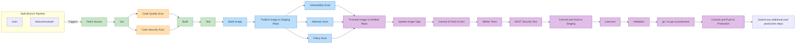

# DevSecOps Pipeline

```mermaid
graph LR
    subgraph mbp["Multi Branch Pipeline"]
        main["main"]
        feature["feature/example"]
    end

    mbp -- "Triggers" --> fetch_src

    fetch_src["Fetch Source"]
    build["Build"]
    lint["Lint"]
    test["Test"]
    quality_scan["Code Quality Scan"]
    security_scan["Code Security Scan"]
    build_image["Build Image"]
    publish["Publish Image to Staging Repo"]
    policy_scan["Policy Scan"]
    vuln_scan["Vulnerability Scan"]
    malware_scan["Malware Scan"]
    promote["Promote Image to Verified Repo"]
    update_tags["Update Image Tags"]
    dev_push["Commit & Push to Dev"]
    dast_test["DAST Security Test"]
    jmeter_test["JMeter Tests"]
    staging_push["Commit and Push to Staging"]
    load_test["Load test"]
    final_validation["Validation"]
    production_gate["go / no-go to production"]
    production_push["Commit and Push to Production"]
    post_production["Submit any additional post production steps"]

    fetch_src --> lint
    lint --> quality_scan
    lint --> security_scan
    quality_scan --> build
    security_scan --> build
    build --> test
    test -->build_image
    build_image --> publish
    publish --> policy_scan
    publish --> vuln_scan
    publish --> malware_scan
    vuln_scan --> promote
    malware_scan --> promote
    policy_scan --> promote
    promote --> update_tags
    update_tags --> dev_push
    dev_push --> jmeter_test
    jmeter_test -->  dast_test
    dast_test --> staging_push
    staging_push --> load_test
    load_test --> final_validation
    final_validation --> production_gate
    production_gate --> production_push
    production_push --> post_production

    style fetch_src fill:#c8e6c9,stroke:#388e3c
    style build fill:#c8e6c9,stroke:#388e3c
    style lint fill:#c8e6c9,stroke:#388e3c
    style test fill:#c8e6c9,stroke:#388e3c
    style quality_scan  fill:#ffe0b2,stroke:#f57c00
    style security_scan  fill:#ffe0b2,stroke:#f57c00
    style build_image fill:#bbdefb,stroke:#1976d2
    style publish fill:#bbdefb,stroke:#1976d2
    style vuln_scan fill:#bbdefb,stroke:#1976d2
    style malware_scan fill:#bbdefb,stroke:#1976d2
    style policy_scan fill:#bbdefb,stroke:#1976d2
    style promote fill:#e1bee7,stroke:#7b1fa2
    style update_tags fill:#e1bee7,stroke:#7b1fa2
    style dev_push fill:#e1bee7,stroke:#7b1fa2
    style jmeter_test fill:#e1bee7,stroke:#7b1fa2
    style dast_test fill:#e1bee7,stroke:#7b1fa2
    style staging_push fill:#e1bee7,stroke:#7b1fa2
    style load_test fill:#e1bee7,stroke:#7b1fa2
    style final_validation fill:#e1bee7,stroke:#7b1fa2
    style production_gate fill:#e1bee7,stroke:#7b1fa2
    style production_push fill:#e1bee7,stroke:#7b1fa2
```
