# DevSecOps Pipeline

Implemented by [templates/pod-pipeline/Jenkinsfile](templates/pod-pipeline/Jenkinsfile).

Source scans are a hard gate: nothing is pushed to JFrog until all of them pass.
They run concurrently with the CI matrix rather than after Lint, which takes them
off the critical path without weakening the gate.

```mermaid
---

config:
    theme: 'base'
    themeVariables:
        lineColor: '#F8B229'

---

graph LR
    subgraph mbp["Multi Branch Pipeline"]
        main["main"]
        feature["feature/example"]
    end

    mbp -- "Triggers" --> fetch_src

    fetch_src["Fetch Source"]
    changed["Detect Changed Services"]

    fetch_src --> changed

    subgraph ci["CI Matrix — one pod per changed service"]
        ci_next["nextjs<br/>lint → build → test"]
        ci_vue["vue<br/>lint → build → test"]
        ci_svelte["sveltekit<br/>lint → build → test"]
        ci_django["django<br/>lint → build → test"]
        ci_go["go<br/>lint → build → test"]
        ci_maven["maven<br/>lint → build → test"]
    end

    subgraph srcscan["Source Scans — gate before any JFrog upload"]
        quality_scan["Code Quality Scan<br/>(SonarQube)"]
        security_scan["Code Security Scan<br/>(Snyk Code)"]
        secret_scan["Secret Detection Scan<br/>(TruffleHog)"]
        source_malware["Source Malware Scan<br/>(ClamAV)"]
        opa_scan["OPA Policy Scan<br/>(pod specs)"]
        verify_base["Verify Base Image<br/>Signatures (Cosign)"]
    end

    changed --> ci
    changed --> srcscan

    subgraph imgmatrix["Image Matrix — one pod per service"]
        img_next["nextjs<br/>build → publish → sign"]
        img_vue["vue<br/>build → publish → sign"]
        img_svelte["sveltekit<br/>build → publish → sign"]
        img_django["django<br/>build → publish → sign"]
        img_go["go<br/>build → publish → sign"]
        img_maven["maven<br/>build → publish → sign"]
    end

    ci --> imgmatrix
    srcscan --> imgmatrix

    subgraph imgscan["Image Scans and SBOMs — per service, verified once upstream"]
        xray_scan["Xray Scan"]
        vuln_scan["Vulnerability Scan (Trivy)"]
        container_scan["Container Security Scan (Snyk)"]
        malware_scan["Container Malware Scan<br/>(ClamAV on image rootfs)"]
        openscap_scan["OpenSCAP Policy Scan"]
        generate_sbom["Generate SBOMs<br/>(Xray export)"]
    end

    promote["Promote Image to Verified Repo"]
    update_tags["Update Image Tags"]
    dev_push["Deploy to Dev"]

    imgmatrix --> imgscan
    imgscan --> promote
    promote --> update_tags
    update_tags --> dev_push

    subgraph devtest["Dev Verification — parallel"]
        jmeter_test["JMeter Tests"]
        dast_test["DAST Security Test (ZAP)"]
    end

    dev_push --> devtest

    staging_push["Deploy to Staging"]
    final_validation["Validation<br/>(smoke, per service)"]
    load_test["Load Test"]
    production_gate["Go / No-Go to Production<br/>(scoped timeout)"]
    production_push["Deploy to Production"]
    post_production["Post Production Notification"]

    devtest --> staging_push
    staging_push --> final_validation
    final_validation --> load_test
    load_test --> production_gate
    production_gate --> production_push
    production_push --> post_production

    style fetch_src fill:#c8e6c9,stroke:#388e3c
    style changed fill:#c8e6c9,stroke:#388e3c
    style ci_next fill:#c8e6c9,stroke:#388e3c
    style ci_vue fill:#c8e6c9,stroke:#388e3c
    style ci_svelte fill:#c8e6c9,stroke:#388e3c
    style ci_django fill:#c8e6c9,stroke:#388e3c
    style ci_go fill:#c8e6c9,stroke:#388e3c
    style ci_maven fill:#c8e6c9,stroke:#388e3c
    style quality_scan fill:#ffe0b2,stroke:#f57c00
    style security_scan fill:#ffe0b2,stroke:#f57c00
    style secret_scan fill:#ffe0b2,stroke:#f57c00
    style source_malware fill:#ffe0b2,stroke:#f57c00
    style opa_scan fill:#ffe0b2,stroke:#f57c00
    style verify_base fill:#ffe0b2,stroke:#f57c00
    style generate_sbom fill:#ffe0b2,stroke:#f57c00
    style img_next fill:#bbdefb,stroke:#1976d2
    style img_vue fill:#bbdefb,stroke:#1976d2
    style img_svelte fill:#bbdefb,stroke:#1976d2
    style img_django fill:#bbdefb,stroke:#1976d2
    style img_go fill:#bbdefb,stroke:#1976d2
    style img_maven fill:#bbdefb,stroke:#1976d2
    style xray_scan fill:#bbdefb,stroke:#1976d2
    style vuln_scan fill:#bbdefb,stroke:#1976d2
    style container_scan fill:#bbdefb,stroke:#1976d2
    style malware_scan fill:#bbdefb,stroke:#1976d2
    style openscap_scan fill:#bbdefb,stroke:#1976d2
    style promote fill:#e1bee7,stroke:#7b1fa2
    style update_tags fill:#e1bee7,stroke:#7b1fa2
    style dev_push fill:#e1bee7,stroke:#7b1fa2
    style jmeter_test fill:#e1bee7,stroke:#7b1fa2
    style dast_test fill:#e1bee7,stroke:#7b1fa2
    style staging_push fill:#e1bee7,stroke:#7b1fa2
    style final_validation fill:#e1bee7,stroke:#7b1fa2
    style load_test fill:#e1bee7,stroke:#7b1fa2
    style production_gate fill:#e1bee7,stroke:#7b1fa2
    style production_push fill:#e1bee7,stroke:#7b1fa2
    style post_production fill:#e1bee7,stroke:#7b1fa2
```

## Changes from the previous shape

| # | Change | Effect |
| - | ------ | ------ |
| 1 | `Detect Changed Services` gates both matrices | Typical commit touches one service, not six. Documentation-only commits skip the artifact path; any other shared-path change fails open to all six |
| 2 | Lint, build and test share one pod per service | Removes 12 pod launches and 12 `node_modules` stash round-trips |
| 3 | Source scans run beside the CI matrix, not after Lint | Removes a pod generation from the critical path; still a hard gate before upload |
| 4 | Base-image verification joins the source-scan group | Was sitting between Test and Build Images |
| 5 | Build, publish and sign merge into one pod per service | Fixes the double build; drops 6 serial `cosignSign` pods |
| 6 | Scanners take `skip_verify` | Drops ~7 nested `cosignVerify` pods |
| 7 | Snyk and OpenSCAP fan out per image instead of looping | ~12 serial launches become parallel |
| 8 | SBOM export runs beside the image scans | Removes 6 duplicate Snyk re-scans and a join barrier |
| 9 | Container malware scan targets the image rootfs | Was rescanning `demos/`, already covered by the source scan |
| 10 | JMeter and DAST run together against dev | Two sequential test generations become one |
| 11 | Smoke validation precedes the load test | Fails fast instead of after a full load run |
| 12 | JMeter and smoke tests fan out | 12 serial JMeter pods and 6 serial curl pods collapse |
| 13 | `failFast` on the CI and image matrices | One broken service stops the fan-out early |
| 14 | `Production Gate` has its own 2h timeout | Human approval no longer consumes the build budget |
| 15 | Per-service JFrog build names | Xray scans and promotions no longer collide on one build record |

Serial pod launches on a full `main` build drop from roughly 55–60 to roughly 14.
Numbers are structural counts, not measurements.

## Known gaps

- No service in `demos/` ships a `Dockerfile`, so `Build and Publish Images`
  cannot pass yet. This predates the restructure.
- `demos/maven` has a `pom.xml` but no `./mvnw`, so the matrix uses the maven
  image's own `mvn`. No checkstyle plugin is configured either, so maven is the
  one service with no lint step.
- Each CI pod installs dependencies before linting, because `node_modules/` is
  gitignored and so never travels in the workspace stash.
- `changedServices` fails open: only `.md`, `.gitignore`, `README` and `LICENSE`
  paths count as build-irrelevant. Any other change outside a single
  `demos/<service>/` directory still selects all six services. A commit touching
  only documentation selects none, and the `has_services` guard then skips every
  artifact-producing stage.
- `base_images` defaults to empty. Ironbank base images are signed by
  `registry1.dso.mil`, not the build's KMS key, so they need
  certificate-identity verification rather than the key-based check
  `cosignVerify` performs. See the TODO at `demos/Jenkinsfile`.
- Dependency caching (npm, pip, gradle) and the ClamAV signature database are
  still re-fetched per run. Persisting them needs a PVC or pre-baked images while
  staying inside the JFrog-only download rule.

## Not addressed

`ideas.md` proposes decoupling DevSecOps from the CI/CD path entirely — scans run
alongside the non-prod deploy and file tickets rather than blocking, with prod
gated on ticket state. That removes the scan block from the critical path instead
of shortening it, and conflicts with the current rule that nothing reaches JFrog
before scans pass.
