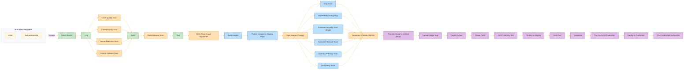

# DevSecOps Pipeline

```mermaid
---

config:
    theme: 'base'
    themeVariables:
        lineColor: '#F8B229'

---

graph LR
    subgraph mbp["Multi Branch Pipeline"]
        main["main"]
        feature["feature/example"]
    end

    mbp -- "Triggers" --> fetch_src

    fetch_src["Fetch Source"]
    lint["Lint"]
    quality_scan["Code Quality Scan"]
    security_scan["Code Security Scan"]
    secret_scan["Secret Detection Scan"]
    source_malware["Source Malware Scan"]
    build["Build"]
    build_malware["Build Malware Scan"]
    test["Test"]
    verify_base["Verify Base Image Signatures"]
    build_image["Build Images"]
    publish["Publish Images to Staging Repo"]
    sign_images["Sign Images (Cosign)"]
    xray_scan["Xray Scan"]
    vuln_scan["Vulnerability Scan (Trivy)"]
    container_scan["Container Security Scan (Snyk)"]
    malware_scan["Container Malware Scan"]
    openscap_scan["OpenSCAP Policy Scan"]
    opa_scan["OPA Policy Scan"]
    generate_sbom["Generate / Validate SBOMs"]
    promote["Promote Image to Verified Repo"]
    update_tags["Update Image Tags"]
    dev_push["Deploy to Dev"]
    jmeter_test["JMeter Tests"]
    dast_test["DAST Security Test"]
    staging_push["Deploy to Staging"]
    load_test["Load Test"]
    final_validation["Validation"]
    production_gate["Go / No-Go to Production"]
    production_push["Deploy to Production"]
    post_production["Post Production Notification"]

    fetch_src --> lint
    lint --> quality_scan
    lint --> security_scan
    lint --> secret_scan
    lint --> source_malware
    quality_scan --> build
    security_scan --> build
    secret_scan --> build
    source_malware --> build
    build --> build_malware
    build_malware --> test
    test --> verify_base
    verify_base --> build_image
    build_image --> publish
    publish --> sign_images
    sign_images --> xray_scan
    sign_images --> vuln_scan
    sign_images --> container_scan
    sign_images --> malware_scan
    sign_images --> openscap_scan
    sign_images --> opa_scan
    xray_scan --> generate_sbom
    vuln_scan --> generate_sbom
    container_scan --> generate_sbom
    malware_scan --> generate_sbom
    openscap_scan --> generate_sbom
    opa_scan --> generate_sbom
    generate_sbom --> promote
    promote --> update_tags
    update_tags --> dev_push
    dev_push --> jmeter_test
    jmeter_test --> dast_test
    dast_test --> staging_push
    staging_push --> load_test
    load_test --> final_validation
    final_validation --> production_gate
    production_gate --> production_push
    production_push --> post_production

    style fetch_src fill:#c8e6c9,stroke:#388e3c
    style build fill:#c8e6c9,stroke:#388e3c
    style lint fill:#c8e6c9,stroke:#388e3c
    style test fill:#c8e6c9,stroke:#388e3c
    style quality_scan fill:#ffe0b2,stroke:#f57c00
    style security_scan fill:#ffe0b2,stroke:#f57c00
    style secret_scan fill:#ffe0b2,stroke:#f57c00
    style source_malware fill:#ffe0b2,stroke:#f57c00
    style build_malware fill:#ffe0b2,stroke:#f57c00
    style verify_base fill:#ffe0b2,stroke:#f57c00
    style sign_images fill:#ffe0b2,stroke:#f57c00
    style generate_sbom fill:#ffe0b2,stroke:#f57c00
    style build_image fill:#bbdefb,stroke:#1976d2
    style publish fill:#bbdefb,stroke:#1976d2
    style xray_scan fill:#bbdefb,stroke:#1976d2
    style vuln_scan fill:#bbdefb,stroke:#1976d2
    style container_scan fill:#bbdefb,stroke:#1976d2
    style malware_scan fill:#bbdefb,stroke:#1976d2
    style openscap_scan fill:#bbdefb,stroke:#1976d2
    style opa_scan fill:#bbdefb,stroke:#1976d2
    style promote fill:#e1bee7,stroke:#7b1fa2
    style update_tags fill:#e1bee7,stroke:#7b1fa2
    style dev_push fill:#e1bee7,stroke:#7b1fa2
    style jmeter_test fill:#e1bee7,stroke:#7b1fa2
    style dast_test fill:#e1bee7,stroke:#7b1fa2
    style staging_push fill:#e1bee7,stroke:#7b1fa2
    style load_test fill:#e1bee7,stroke:#7b1fa2
    style final_validation fill:#e1bee7,stroke:#7b1fa2
    style production_gate fill:#e1bee7,stroke:#7b1fa2
    style production_push fill:#e1bee7,stroke:#7b1fa2
    style post_production fill:#e1bee7,stroke:#7b1fa2
```
